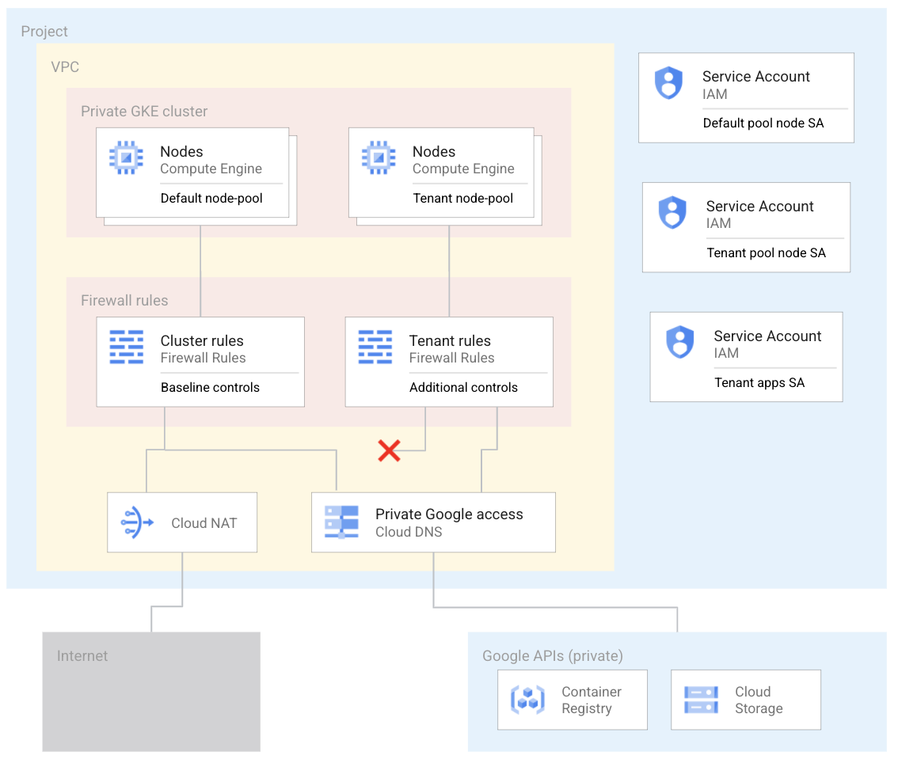
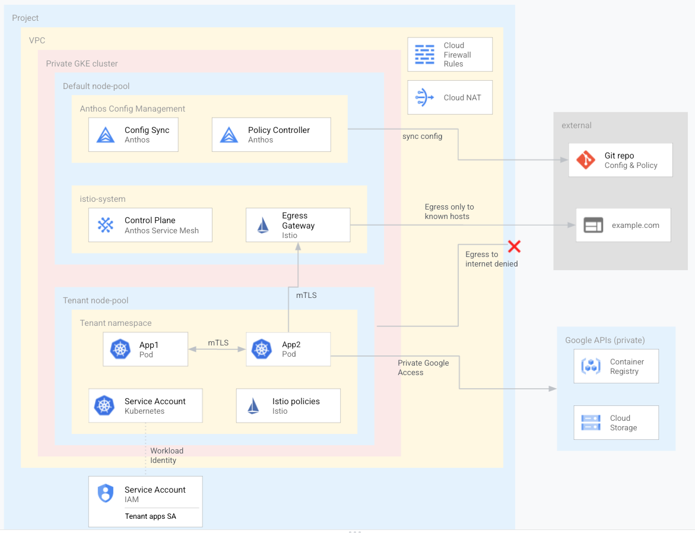

# [WIP] Anthos for federation setup blueprint

This repository contains a blueprint that creates Google Cloud infrastructure that is ready to participate in 
federated computations such as [federated learning](https://en.wikipedia.org/wiki/Federated_learning). 

Specifically, the blueprint creates and configures a Google Kubernetes Engine (GKE) cluster and related infrastructure
such that the cluster is ready to participate as a processing node ("silo") in a federated computation. The federated
computation may involve running third party apps or models; these third party resources are treated as a tenant
within the cluster. As the tenant apps performing federated computation are potentially untrusted, the cluster is configured 
according to security best practices, and the tenant apps are hosted on dedicated nodes with additional controls. 
The blueprint uses [Anthos](https://cloud.google.com/anthos) features to automate and optimise the configuration and security of the cluster.

The initial version of the blueprint creates infrastructure in Google Cloud. It can be extended to Anthos clusters running on premises
or on other public clouds

## Requirements / Caveats
To deploy this blueprint you need:
- A Google Cloud project with billing enabled
- Owner permissions on the project (TODO: tighten this up)
- It is expected that you deploy the blueprint using Cloud Shell. If you want to execute locally you'll need Terraform, gcloud and kubectl
  - NOTE that installation on Mac does not work well due to problems with ASM installation scripts. Use Cloud Shell.
- You create the infastructure using Terraform. The blueprint uses a local [backend](https://www.terraform.io/docs/language/settings/backends/configuration.html). It is recommended to configure a remote backend for anything other than experimentation
- You use Anthos Config Management to configure your cluster. It is recommended to create a new git repository (e.g. on Github) to host cluster configs.

## Understanding the repository structure
This repository has the following folders.

* [terraform](terraform): contains the Terraform code used to create the GKE "silo" cluster, firewall rules etc. It also installs Anthos components into the cluster

* [configsync](configsync): contains the configuration and policies that are applied to your GKE cluster by Anthos Config
  Management (ACM). It is recommended to copy this directory to a new git repository that you own.

* [tenant-config-pkg](tenant-config-pkg): a [kpt](https://kpt.dev/?id=overview) package that you can use to configure new tenants in the GKE cluster.
The package contains baseline tenant resources such as a namespace, service account, and Istio resources.


## Architecture
### Infrastructure
The following diagram describes the infrastructure created by the blueprint


The infrastructure includes:
- A private GKE cluster. The cluster nodes do not have access to the internet.
- Two GKE node-pools. 
  - You create a dedicated node pool to exclusively host tenant apps and resources. The nodes have taints to ensure that only tenant workloads
  are scheduled onto the tenant nodes
  - Other cluster resources are hosted in the default node pool.
- Firewall rules
  - Baseline rules that apply to all nodes in the cluster.
  - Additional rules that apply only to the nodes in the tenant node-pool (targeted using the node Service Account below). These firewall rules limit egress from the tenant nodes.
- Cloud NAT to allow egress to the internet
- Cloud DNS rules configured to enable Private Google Access such that apps within the cluster can access Google APIs without traversing the internet
- Service Accounts used by the cluster. 
  - A dedicated Service Account used by the nodes in the tenant node-pool
  - A dedicated Service Account for use by tenant apps (via Workload Identity, discussed later)

### Applications
The following diagram describes the apps and resources within the GKE cluster


The cluster includes:
- Anthos Config Management
  - Config Sync keeps cluster configuration in sync with config defined in a Git repository. The config defines namespaces, service accounts, Policy Controller policies 
  and Istio resourcess that are applied to the cluster
  - Policy Controller enforces policies for your clusters. These policies act as "guardrails" and prevent any changes to your cluster that violate security, operational, or compliance controls.
- Anthos Service Mesh is powered by Istio and enables managed, observable, and secure communication across your services. The mesh configuration is defined in a git repo, and is applied to the cluster using Config Sync. The following points describe how this blueprint configures the service mesh. 
  - The root istio namespace (istio-system) is configured with
    - PeerAuthentication resource to allow only STRICT mTLS communications between services in the mesh
    - AuthorizationPolicies that:
      - by default deny all communication between services in the mesh, 
      - allow communication to a set of known external hosts (such as example.com)
    - Egress Gateway that acts a forward-proxy at the edge of the mesh
    - VirtualService and DestinationRule resources that route traffic from sidecar proxies through the egress gateway to external destinations.
  - The tenant namespace is configured for sidecar proxy injection (hence the tenant namespace is part of the mesh). The namespace-level resources include:
    - Sidecar resource that allows egress only to known hosts (outboundTrafficPolicy: REGISTRY_ONLY)
    - AuthorizationPolicy that defines the allowed communication paths within the namespace. The blueprint only allows requests that originate from within the same namespace. This
    policy is added to the root policy in the istio-system namespace
  - Note that the mesh does not include an Ingress Gateway
- A dedicated namespace for tenant apps and resources
  - The tenant namespace is part of the service mesh. Pods in the namespace receive sidecar proxy containers.
  - The apps and resources in the tenant namespace are hosted on nodes in the dedicated tenant node-pool. 
    - Any pod deployed to the tenant workspace automatically receives a toleration (related to the node taint above) and nodeSelector to ensure that it is scheudled only a tenant node
    - The toleration and nodeSelector are automatically applied using Policy Controller mutations
  - The apps in the tenant namespace use a dedicated Kubernetes service account that is linked to a Google Cloud service account using Workload Identity. This way you can grant appropriate IAM permissions to interact with any required Google APIs.
  - RBAC rules (RoleBindings) that grant particular users permissions to interact with certain resources in the namespace.
    - For example, different teams might be responsible for managing apps within each tenant namespace
    - Users and teams managing tenant apps should not have permissions to change cluster configuration or modify istio resources
  

## Deploy the blueprint
- Open Cloud Shell

- Clone this repo

- Change into the directory that contains the Terraform code
  ```cd terraform```

- Review the `terraform.tfvars` file and replace values appropriately

- Set a Terraform environment variable for your project ID  
  ```export TF_VAR_project_id=[YOUR_PROJECT_ID]```

- Initialise Terraform  
  ```terraform init```

- Create the plan; review it so you know what's going on  
  ```terraform plan -out terraform.out```

- Apply the plan to create the cluster. Note this may take ~15 minutes to complete  
  ```terraform apply terraform.out```


##  Test
See [testing](testing) for some manual tests you can perform to verify setup


## Add another tenant
Out-of-the-box the blueprint is configured with a single tenant. You can add more tenants by updating the config. Each tenant is configured in the same way.

See [testing](testing).
